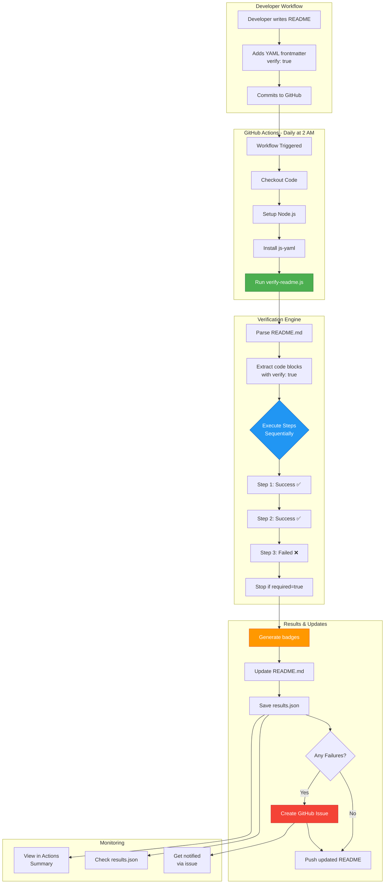

## System Architecture

### 1. **Input Layer** (README.md)
- Developers write setup instructions
- Mark verifiable steps with YAML frontmatter
- Code blocks contain actual commands

### 2. **Execution Layer** (GitHub Actions + verify-readme.js)
- Runs on schedule (daily) or manually
- Parses README to extract marked steps
- Executes commands sequentially on macOS
- Captures success/failure and output

### 3. **Results Layer**
- Generates status badges
- Updates README automatically
- Saves detailed results to JSON
- Creates issues on failures

### 4. **Feedback Loop**
- Developers see badges in README
- Get notified via GitHub issues
- Can view detailed logs in Actions
- Manual verification available anytime

## Data Flow

```
README.md (with YAML)
    ↓
verify-readme.js (parser)
    ↓
Code Execution (sequential)
    ↓
results.json (structured data)
    ↓
Badge Generator
    ↓
Updated README.md + Commit
```

## Key Components

1. **verify-readme.js**: Core verification engine
2. **verify-readme.yml**: GitHub Actions workflow
3. **config.yml**: Configuration settings
4. **results.json**: Verification results storage
5. **YAML frontmatter**: Step metadata in README

## Badge Generation Flow

```
results.json
    ↓
Calculate: success/failed/warnings
    ↓
Determine status color (green/yellow/red)
    ↓
Generate shields.io URLs
    ↓
Replace <!-- VERIFICATION-BADGES --> section
    ↓
Commit updated README.md
```
